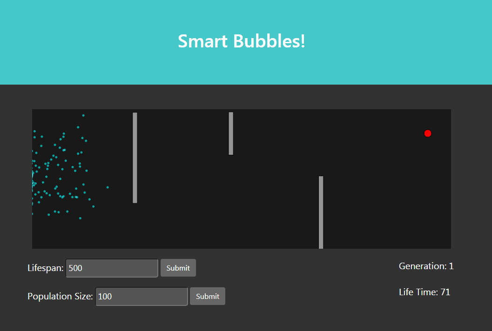
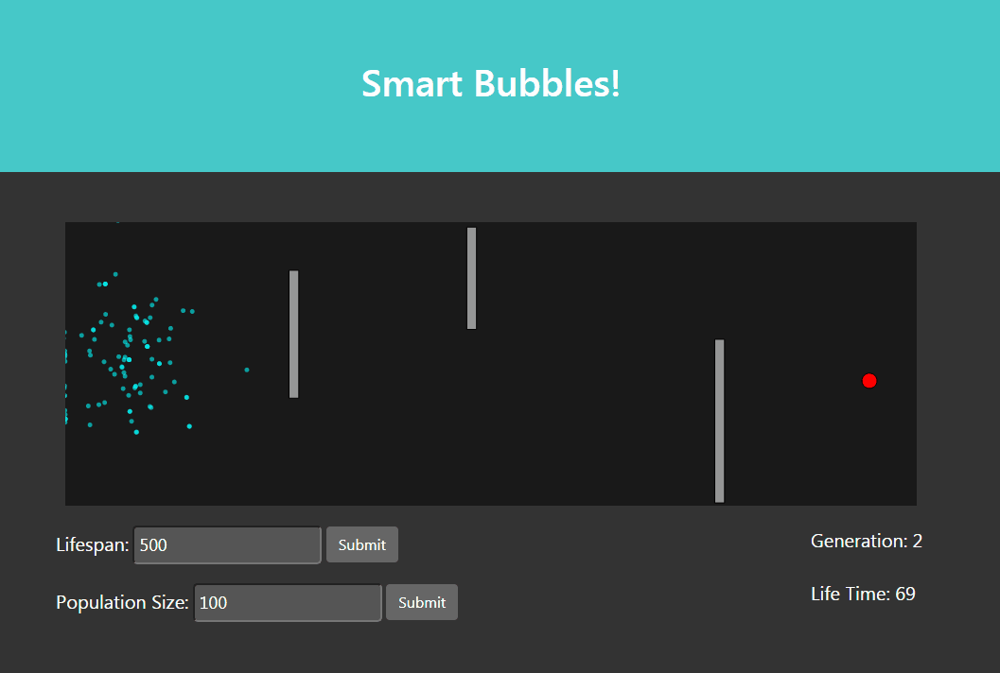

# Smart Bubbles!

A visual demonstration of evolutionary learning in action. A variable population of bubbles are given a variable lifespan and are tasked with the job of getting to the end target (red circle). In order for the bubbles to learn from their mistakes, a typical genetic algorithm is implemented from scratch without the use of machine learning libraries. This project was written using JavaScript, HTML, CSS, Bootstrap, and the p5.js library

Vary the population size and lifespan for interesting results!

